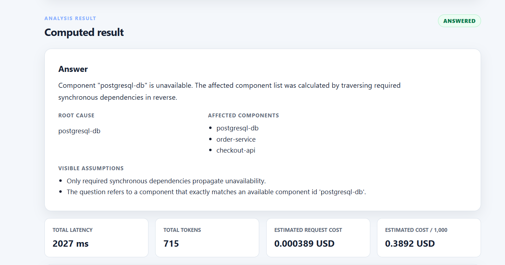
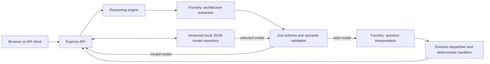

# Architecture Reasoning Engine

An AI-assisted architecture analysis prototype that turns plain-language system descriptions and what-if questions into validated models and explainable, deterministic results.

## The problem

Architecture descriptions are often informal, while questions about failures, latency, and load need explicit assumptions and reproducible calculations. A plausible answer is not enough if a component, dependency, or required number is missing. This project makes the model visible, limits the questions it can answer, and returns `NOT_ANSWERABLE` when the available information does not support a calculation.

**Design principle: AI interprets; application code validates and calculates.** Microsoft Foundry extracts a formal architecture model and interprets a question as a structured scenario. Zod schemas, semantic checks, and deterministic JavaScript handlers decide whether the scenario is answerable and calculate the result. The language model does not calculate capacity, utilization, timeout impact, or dependency effects.

## Key capabilities

- Extract services, data stores, workloads, dependencies, and stated assumptions from a description into an inspectable formal model.
- Validate model structure and semantics, including missing information and dependency errors.
- Analyze component unavailability, latency degradation, incoming-load multiplication, and asynchronous circuit-breaker state snapshots (`open`, `half_open`, `closed`).
- Calculate capacity, retry-amplified load, utilization, saturation, timeout impact, and affected components where the model provides the necessary data.
- Save formal models as immutable local JSON versions, edit by creating a new version, and analyze a selected version without extracting its architecture again.
- Show request latency, token usage, and a code-calculated cost estimate for Foundry calls.

## Example output

This screenshot shows analysis of a previously saved formal model. Microsoft Foundry interpreted the natural-language question as a component-unavailability scenario; deterministic application code then calculated the affected components by traversing required synchronous dependencies. The interface also shows assumptions, latency, token usage, and estimated request cost. The displayed telemetry belongs to this recorded request and can vary between executions.



## Architecture and workflow



For a new description, `POST /api/analyze` extracts a model, validates it, interprets the question, and dispatches the structured scenario to application code. The response includes the model, validation findings, scenario, result, and telemetry. Invalid or incomplete inputs can produce `NOT_ANSWERABLE` with a reason rather than a fabricated answer. For a saved model, `POST /api/models/:id/analyze` skips architecture extraction and uses Foundry only to interpret the new question.

The browser interface is served from `public/`. The HTTP API and orchestration live in `src/server.js` and `src/reasoningEngine.js`; schemas and semantic rules are in `src/model/`, deterministic analysis is in `src/engine/`, Foundry adapters are in `src/llm/`, and local persistence is in `src/storage/`.

## Supported scenarios

| Scenario | What application code evaluates |
| --- | --- |
| Component unavailable | Effects across required synchronous dependencies and affected components |
| Latency degradation | New component latency and applicable timeout effects |
| Incoming-load multiplication | Effective load, retries, capacity, utilization, and saturation |
| Asynchronous circuit-breaker state change | Downstream calls, probes, and message disposition for an explicitly requested state |

Circuit-breaker analysis treats each state as a snapshot; it does not simulate time or automatic transitions. See [MODEL.md](MODEL.md) for the formal model, formulas, and answerability rules.

## Stack

Node.js 22 (the version used by the Docker image), plain JavaScript, Express, Zod, the OpenAI-compatible SDK for Microsoft Foundry, dotenv, a plain HTML/CSS/JavaScript interface, local JSON persistence, and the built-in Node.js test runner. Docker Compose provides an optional local container setup.

## Run locally

### Prerequisites

- Node.js 22 or later and npm for the local setup, or Docker with Docker Compose for the container setup.
- A Microsoft Foundry deployment with an Azure OpenAI v1-compatible base URL and API key **for live natural-language analysis**. The deterministic test suite does not need Foundry credentials.

Install dependencies:

```bash
npm ci
```

Create the local environment file on macOS/Linux:

```bash
cp .env.example .env
```

Or on Windows PowerShell:

```powershell
Copy-Item .env.example .env
```

Then start the server:

```bash
npm start
```

Edit the local `.env` file to configure `OPENAI_BASE_URL`, `OPENAI_API_KEY`, and `OPENAI_MODEL` for your own Foundry deployment. `.env.example` contains placeholders; `.env` is ignored by Git. The server listens on port 3000 by default; open `http://localhost:3000` for the browser interface. You can check the process at `GET /health` without a Foundry call.

Run deterministic automated tests with:

```bash
npm test
```

The live validation script is separate from the tests above and requires working Foundry configuration; its procedure is documented in [VALIDATION.md](VALIDATION.md).

### Docker Compose

Create and configure `.env` as above, then run:

```bash
docker compose up --build
```

The Compose file exposes port 3000, injects `.env` at runtime, checks `/health`, and keeps saved models in the named `architecture-model-data` volume. The Docker image installs production dependencies and copies `src/` and `public/`; credentials are not baked into the image.

## API example

With the server running and Foundry configured, send a new description and question to the implemented endpoint:

```bash
curl -X POST http://localhost:3000/api/analyze \
  -H "Content-Type: application/json" \
  -d '{"description":"A web API receives 20 requests per second. It has 2 replicas, each able to process 100 requests per second, and a baseline latency of 50 milliseconds.","question":"What happens if the web API becomes unavailable?"}'
```

The JSON response contains `status`, `reason`, `model`, `modelValidation`, `scenario`, `result`, and `telemetry`. Other implemented routes list, create, retrieve, and version formal models (`/api/models` and `/api/models/:id`), and analyze a selected stored version (`/api/models/:id/analyze`).

## Validation evidence

The repository defines **15 live validation cases** covering supported scenarios, incomplete or ambiguous input, contradictory input, and refusal behavior. The [latest recorded report](validation/latest-report.json) shows **15/15 expectation matches**. These matches measure the defined cases and their stated expectations; they are **not a claim of universal model accuracy**. The deterministic tests cover schemas, semantic rules, calculations, persistence, API behavior, and scenario handlers without live Foundry calls. See [VALIDATION.md](VALIDATION.md) for the validation approach.

## Status and limits

This is a working, single-user demonstration with four supported scenario categories and a formal model limited to small graphs (up to 15 components). Calculations assume steady-state conditions. It does not model queue depth, probabilistic traffic, regional failover, or recovery over time; declared availability targets are not measured availability. Local JSON storage is intended for one application instance. Authentication, authorization, tenant isolation, and concurrency controls would be needed before shared production use. See [LIMITATIONS.md](LIMITATIONS.md) for the current boundaries and possible evolution, and [DECISIONS.md](DECISIONS.md) for architectural tradeoffs.

## Why this project matters

The project demonstrates how to put a clear boundary around AI-assisted architecture reasoning: use a model to interpret flexible language, then require explicit data, validation, and deterministic code for claims about system behavior. Its formal model, visible assumptions, refusals, and focused validation make each supported answer easier to inspect and challenge.

## License

This project is licensed under the MIT License. See [LICENSE](LICENSE) for details.
